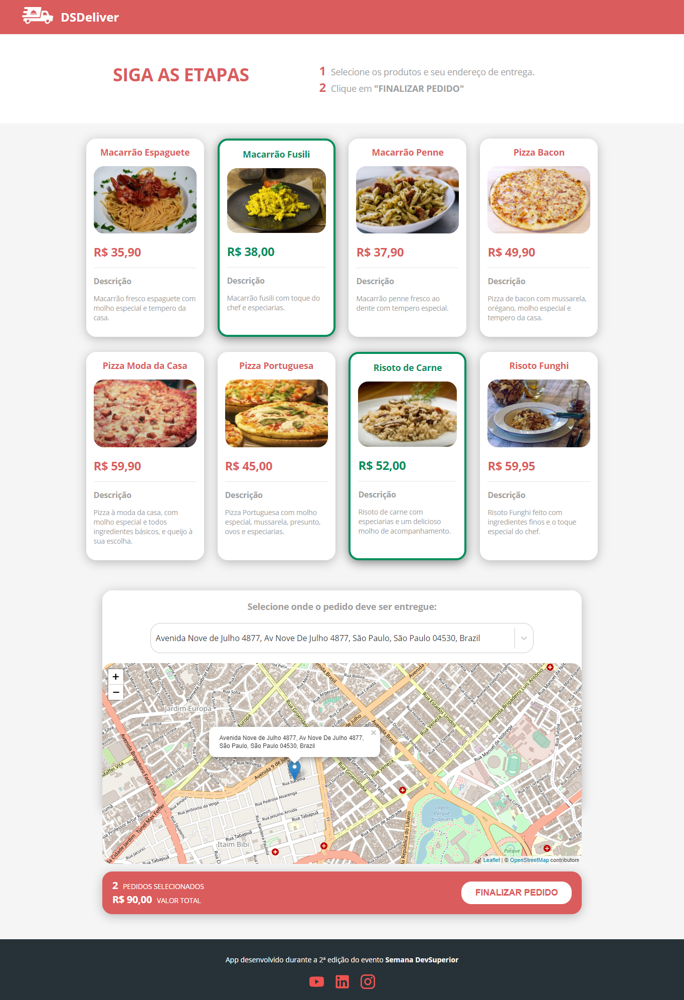
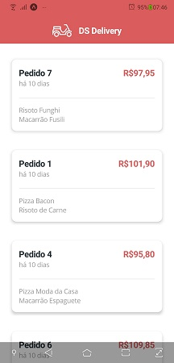

<h1 align="center">
   DSDeliver
</h1>

<div align="center">
   
</div>

<br />
<br />

<h3 align="center">
   <a href="#-tecnologias-utilizadas">
      
      
      
      
      
      
      
      
   </a>
</h3>

<div align="center">

[**Sobre**](#-sobre) &nbsp;&nbsp;**|**&nbsp;&nbsp;
[**Features**](#-features) &nbsp;&nbsp;**|**&nbsp;&nbsp;
[**Netlify**](#-aplicação-web-no-netlify) &nbsp;&nbsp;**|**&nbsp;&nbsp;
[**Tecnologias utilizadas**](#-tecnologias-utilizadas) &nbsp;&nbsp;**|**&nbsp;&nbsp;
[**Layout**](#-layout) &nbsp;&nbsp;**|**&nbsp;&nbsp;
[**Instalação e execução**](#-instalação-e-execução) &nbsp;&nbsp;**|**&nbsp;&nbsp;
[**Como contribuir**](#-como-contribuir) &nbsp;&nbsp;**|**&nbsp;&nbsp;
[**Contato**](#-contato) &nbsp;&nbsp;**|**&nbsp;&nbsp;
[**Licença**](#-licença)

</div>

## 📃 Sobre

**DSDeliver** foi o projeto desenvolvido durante a **Semana DevSuperior 2.0** - um evento produzido pela [**DevSuperior**](https://github.com/devsuperior) com duração de uma semana - em que foram desenvolvidos o back-end, front-end web, e o aplicativo mobile.

Esta é uma aplicação que registra os pedidos realizados pelos clientes dos restaurantes e organiza as entregas para os endereços informados.

## ✨ Features

✔ Listagem de produtos via API (Backend)

✔ Seleção de items do pedido

✔ Busca de endereços através de um mapa interativo e dinâmico

✔ Validação e finalização de pedidos

✔ Layout responsivo

✔ Página de erro 404 personalizada para rotas inexistentes

✔ Indicador de Loading durante o carregamento dos dados dos produtos (via API)

## 🌎 Aplicação Web no Netlify

Link para acessar a aplicação hospedada no Netlify:

[**dsdeliver-sds2-taoh.netlify.app**](dsdeliver-sds2-taoh.netlify.app)

> Obs.: na primeira vez que for executado, é possível que levem alguns segundos para seja feita a conexão com API, devido ao tempo necessário para reativação do servidor (Heroku).

## 🚀 Tecnologias utilizadas

Este projeto foi desenvolvido com as seguintes tecnologias:

- [**JDK 11**](https://www.oracle.com/java/technologies/javase-jdk11-downloads.html): Java Development Kit 11 - um kit de desenvolvimento para construção de aplicações e componentes usando a linguagem de programação Java;

- [**IntelliJ IDEA**](https://www.jetbrains.com/pt-br/idea/): IDE (Ambiente de desenvolvimento integrado) desenvolvida pela JetBrains para softwares baseados em JVM.

- [**Postman**](https://www.postman.com/): uma ferramenta que tem como objetivo testar serviços RESTful (Web APIs) por meio do envio de requisições HTTP e da análise do seu retorno;

  > O workspace do Postman com as requisições está disponível para download neste repositório. Baixe e importe o arquivo **`DSDeliver.postman_collection.json`** em seu Postman.

- [**Postgresql 12**](https://www.postgresql.org/download/): um sistema gerenciador de banco de dados objeto relacional (SGBD), desenvolvido como projeto de código aberto;

- [**pgAdmin**](https://www.pgadmin.org/): ferramenta para administração do Postgresql, permite fazer realizar as tarefas necessárias para administração do banco de dados;

- [**Heroku CLI**](https://devcenter.heroku.com/articles/heroku-cli): interface de linha de comando do Heroku que facilita a criação e gerenciamento de seus apps no Heroku diretamente de um terminal;

- [**Git**](https://git-scm.com/downloads): o sistema de controle de versão distribuído de código aberto mais utilizado;

- [**Visual Studio Code**](https://code.visualstudio.com/): um editor de código-fonte desenvolvido pela Microsoft para Windows, Linux e macOS, recomendado para o desenvolvimento de aplicações web;

- [**Node.js**](https://nodejs.org/en/): um interpretador de JavaScript assíncrono com código aberto orientado a eventos;

- [**TypeScript**](https://www.typescriptlang.org/): um super conjunto da linguagem JavaScript que fornece classes, interfaces e tipagem estática opcional. Utilizado em conjunto com React no frontend web;

- [**React**](https://reactjs.org): uma biblioteca JavaScript de código aberto com foco em criar interfaces de usuário (frontend) em páginas web. É mantido pelo Facebook, Instagram, outras empresas e uma comunidade de desenvolvedores individuais. É utilizado nos sites da Netflix, Imgur, Feedly, Airbnb, SeatGeek, HelloSign, Walmart e outros;

- [**React Native**](https://facebook.github.io/react-native/): uma biblioteca Javascript criada pelo Facebook. É usada para desenvolver aplicativos para os sistemas Android e IOS de forma nativa;

## 📟 Layout

<figure>
<div align="center">
  
  <figcaption>Layout das telas da aplicação</figcaption>
</div>
</figure>

<figure>
<div align="center">
  
  <figcaption>Página inicial</figcaption>
</div>
</figure>

<figure>
<div align="center">
  
  <figcaption>Página de pedidos</figcaption>
</div>
</figure>

<figure>
<div align="center">
  
  
  
  <figcaption>Mobile</figcaption>
</div>
</figure>

## 🔧 Instalação e execução

Para baixar o código-fonte do projeto em sua máquina, primeiramente terá que ter instalado o [**Git**](https://git-scm.com/).

Com o Git instalado, em seu terminal execute o seguinte comando:

```bash
$ git clone https://github.com/taohansens/sds2-dsdeliver.git
```

### Backend

- Como será executado localmente em sua máquina, abra o arquivo **`application.properties`** e altere o perfil ativo de **`prod`** para **`test`**:
- Execute o arquivo **`DsdeliverApplication.java`**.
- A aplicação Spring Boot será executada no endereço: _**`http://localhost:8080/`**_.

---

### Frontend web

Para instalar e executar o frontend-web do DSDeliver, terá que ter instalado em sua máquina também o [**Node.js**](https://nodejs.org/en/).

1. Vá até a pasta front-web do repositório:
   ```bash
   $ cd front-web
   ```
2. Instale as dependências do projeto:
   ```bash
   $ npm install
   ```
   Atenção, antes de executar a aplicação React:

> Para a busca de endereços no mapa, foi utilizado o [**Mapbox**](https://www.mapbox.com/), uma plataforma de mapeamento que permite que seus clientes criem soluções de mapeamento personalizadas.

- Inicie a aplicação React:
  ```bash
  $ npm start
  ```
- Acesse a aplicação pelo endereço: _**`http://localhost:3000/`**_.

---

### Mobile

- Vá até a pasta front-mobile do repositório:
   ```bash
   $ cd front-mobile
   ```
- Instale as dependências do projeto utilizando a biblioteca Expo:
   ```bash
   $ expo install
   ```
3. Inicie a aplicação:
   ```bash
   $ npm start
   ```
   

## 📝 Licença

<a href="https://github.com/taohansens/sds2-dsdeliver/blob/main/LICENSE">
    
</a>

Esse projeto está sob a licença **MIT**. Veja o arquivo _**LICENSE**_ para mais detalhes.

---

<h5 align="center">
  &copy;2022 - <a href="https://github.com/taohansens/">Tao Hansen</a>
</h5>
